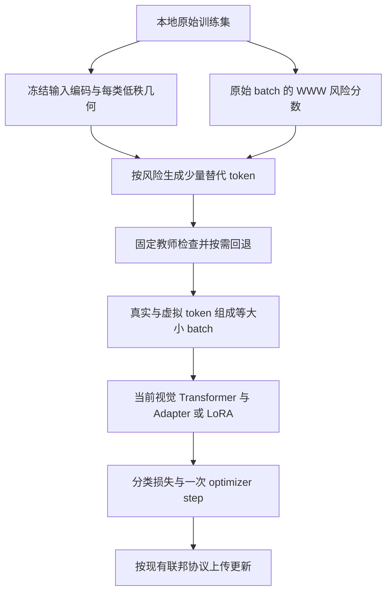

# 本地类别分布与风险指导的虚拟样本生成方案

日期：2026-09-10。2026-09-12 已实现初版 CLIP Adapter/LoRA + FedAvg 的 `risk_synthesis` 分支，并开始真实数据验证；尚未证明防御有效。本文保留原始设计，实际配置、验收和实验进展见 [研究记录](risk_synthesis_research_log.md)。

目标是在各客户端内部估计类别特征的几何结构，复用现有 WWW 损失差风险分数，生成替代训练编码，减少模型对高风险原始记录的直接拟合，同时尽量保留分类能力。客户端不上传这些统计量、风险分数或虚拟编码；联邦训练继续上传模型更新。

第一版建议采用 CLIP-Adapter/LoRA 的输入编码级生成，并先接入 FedAvg。这里的“虚拟样本”是一组可送入视觉 Transformer 的 token，不是已经生成的 RGB 图片。若要求可查看的图片，需要另行加入图像生成或重建模块。

## 1. 当前实验条件与论文适配边界

- Adapter/LoRA 当前在客户端划分前每类取 100 张，10 个 IID 客户端时，每客户端每类只有 10 张。CIFAR100 每客户端 1,000 张，Food101 每客户端 1,010 张。
- 模型 YAML 默认仍为 FedSGD；统一入口显式选择 FedAvg 后，默认 100 轮、每轮一个本地 epoch、按原始本地样本数聚合。本文推荐首轮原图训练，从第二轮具备风险参考状态后开始生成。
- Nguyen 论文的 ViT 路径在 Patch+Position Embedding 层进行扰动。本文借用这个介入位置，不照搬其 LDP 机制或攻击保证。
- Ma 论文先用 CLIP 提取最终图像嵌入，利用类别协方差的特征方向生成嵌入，并训练 MLP；还包含跨客户端的几何统计聚合。本文仅借用本地几何估计和沿几何方向采样的思路，并新增风险控制。输入 token 的几何建模是本方案的适配，不是 Ma 原方法的直接复现。
- 当前逐层视觉 Adapter、视觉 LoRA 都位于图像编码器内部。直接对最终 512 维向量训练会绕过这些可训练层。因此需要区分“用于生成并参与反向传播的输入编码”和“用于检查语义的最终特征”。

论文来源：[Nguyen 官方论文页](https://proceedings.mlr.press/v267/nguyen25j.html)、[Nguyen 仓库 PDF](../paper/Nguyen%20等%20-%20Theoretically%20Unmasking%20Inference%20Attacks%20Against%20LDP-Protected%20Clients%20in%20Federated%20Vision%20Models.pdf)、[Ma 仓库 PDF](../paper/Ma%20等%20-%20Geometric%20Knowledge-Guided%20Localized%20Global%20Distribution%20Alignment%20for%20Federated%20Learning.pdf)。

## 2. 两种表示，各司其职

| 表示 | 当前 ViT-B/32 的形状 | 用途 | 更新策略 |
| --- | --- | --- | --- |
| Patch+Position 编码 H | 每张 49 × 768，另有一个公共 CLS token | 拟合生成几何、构造虚拟训练输入 | patch/position 层冻结，初始化时计算 |
| 原始冻结 CLIP 的最终图像特征 z | 每张 512 维 | 检查生成结果的类别语义、记录语义分布 | 固定教师，禁止随着当前 Adapter/LoRA 漂移 |

H 取自视觉 embeddings 输出、pre_layrnorm 之前。统计时排除公共 CLS，但保留每个 patch 的位置；将 H 展开为 h ∈ R^37632，保留跨位置相关性。生成后重新组织为 49 × 768，再拼回原有的 CLS+其位置编码。不能重复添加位置编码。

z 由原始冻结 CLIP 在确定性预处理下提取。若共享骨干，需要临时关闭或切回初始 PEFT 状态并完整恢复；“原始骨干参数冻结”不等于“带当前 PEFT 的最终输出不变”。最终特征是否归一化必须固定并写入统计元数据，建议语义检查采用 L2 归一化特征和余弦相似度。

第一版的分布拟合采用固定预处理视图。若未来加入随机裁剪，需要明确统计对应哪个视图；不能把同一图片的多次增强当成多个独立真实记录来估计样本数。

## 3. 每客户端、每类别的本地分布

对客户端 k 的类别 c，设真实编码为 h_1,...,h_n：

\[
\mu_{kc}=\frac{1}{n}\sum_i h_i,\qquad
C_{kc}=\frac{1}{n}\sum_i(h_i-\mu_{kc})(h_i-\mu_{kc})^\top.
\]

均值与协方差描述经验分布的中心和二阶几何，不足以识别完整真实概率密度。后续高斯采样是建模选择，不是“已经证明每类服从高斯分布”。语义空间 z 也可以按相同方式保存每类统计，用于质量检查。

当前 n=10 时，中心化协方差的秩最多为 9。建议保存低秩因子，并可向同一客户端的类内共享几何收缩：

\[
C_{k,\mathrm{pool}}=\frac{1}{N_k}\sum_c\sum_{i:y_i=c}
(h_i-\mu_{kc})(h_i-\mu_{kc})^\top,
\]

\[
\widehat C_{kc}=(1-\lambda)C_{kc}^{(r_c)}+
\lambda C_{k,\mathrm{pool}}^{(r_p)}=L_{kc}L_{kc}^\top.
\]

这里 C^(r) 表示截断后的半正定协方差；L 可由两组低秩因子横向拼接得到，无须重新分解稠密矩阵。初始试验可设 λ=0.5、r_c=min(5,n-1)、r_p≤16；必须同时记录实际数值秩和保留方差比例。共享项只使用该客户端各类别减去各自均值后的残差，不混入类别间均值差，更不向其他客户端请求样本或统计量。这一收缩是额外先验，不能算作增加了独立观测。

实现上直接对中心化数据做薄 SVD，或使用样本 Gram 矩阵；不能构造 37632 × 37632 的稠密协方差，单个 float32 矩阵就约 5.7 GB。原始编码和因子可在 CPU 分块缓存，按客户端加载。只有少量类别样本时，应优先保留原训练输入；建议 n<3 暂停该类别生成并记录原因。

若 C=U diag(d) U^T，则采样因子为 U diag(sqrt(d))。直接使用 d 作为噪声标准差，会把方差变成 d²。[Ma 作者生成代码](https://github.com/WeiDai-David/2025CVPR_GGEUR/blob/main/Single%20Domian/cov_matrix_generate_features.py) 实际使用协方差的 Cholesky 分解进行多元正态采样；本文按协方差含义定义采样尺度。

所有几何统计均从原始本地训练数据建立，不把生成样本循环加入统计，不读取 evaluation/test 或审计非成员池。

## 4. 复用现有风险分数

原始样本 i 在第 t 轮的风险代理量保持现有定义：

\[
M_i^t=\ell(\theta_{-k}^{t-1};x_i,y_i)
-\ell(\theta_k^{t-1};x_i,y_i).
\]

正值较大表示上一轮本客户端模型相对其他客户端聚合模型对该样本更有优势；它可能包含记忆、类别难度与客户端分布差异，不能直接解释为成员概率。theta_-k 来自现有模型更新的参数聚合重建，也不是严格从未见过该记录的模型。

复用 `risk_regularization_weights`：对真实 batch 的 M 升序排列，最高 ceil(0.8B) 个位置按 (j-0.5)/m 映射为 r∈(0,1)，其余为 0。r 是 batch 内相对排序；即使整个 batch 的 M 都为负，也仍有高相对排名。是否再加 M>0 门槛可以作为消融，不能悄悄改变当前 WWW 分数解释。

每次先用原图计算风险，再决定是否替换。第一轮或参考状态缺失时 r=0，正常训练。第一版不依赖旧日志或跨实验缓存，也不额外计算逐样本梯度范数；风险计算需要的只是两个参考模型前向。后续若加入 EMA，应按原始 sample ID 更新，并记录风险来源轮次和缓存年龄。

## 5. 风险控制替换概率与生成中心

风险分数承担两个不同作用：高风险记录更容易被替换；被替换后，生成中心更少依赖该记录自身。

首先，对每个原始 batch 位置，以 p_i=p_max r_i 抽取替换请求；若请求数超过 floor(p_max B)，再无放回选取该上限数量。第一版 p_max=0.25，B=32 时最多替换 8 个位置。按现有 26 个尾部权重计算，上限截断前的期望请求数为 0.25×13=3.25，并非每批固定生成 8 个。短 batch 按实际 B 计算，标签和 batch 总大小保持一致。

对选中的 i，计算同客户端同类、排除 i 后的均值：

\[
\mu_{kc,-i}=\frac{n\mu_{kc}-h_i}{n-1}.
\]

然后生成：

\[
\widetilde h_i=
\mu_{kc,-i}+a(r_i)(h_i-\mu_{kc,-i})+
b L_{kc}\epsilon,\qquad \epsilon\sim\mathcal N(0,I),
\]

\[
a(r)=1-r.
\]

例如 r=0.2 时，生成中心保留 80% 的该样本编码和 20% 的同类其他样本中心；r=0.9 时，这两个比例变为 10% 和 90%。b 可先试 0.1，即沿估计类内标准差尺度施加较小扰动，再试 0、0.2。先固定 b 有利于区分“风险引导中心移动”和“增大随机扰动”的贡献；以后再检验 b 是否应随风险增加。

该式描述有条件的局部采样分布。生成过程、风险、均值和因子都停止梯度；训练梯度只通过随后执行的当前模型。采样后还会经过筛选，因此最终接受分布不再是未筛选的高斯分布，需要记录接受率。

即使 a 接近 0，协方差与风险模型仍可能依赖 h_i，而且 h_i 也会参与其他记录的类别中心。排除自身的均值只减弱一个直接依赖，不能解释为该记录已被彻底移除或获得 DP 保护。

## 6. 质量检查与主要失败模式

输入 token 的线性几何没有保证能保留物体结构。特别是同类对象位置差异大时，向均值移动可能接近图像混合或模糊平均。这是第一版必须检验的可行性问题。

建议最多尝试两次生成，并进行以下检查：

1. token 形状、数值有限性、范数和扰动距离符合预先规定的范围。记录与最近原始训练编码的距离，识别近似复制。
2. 将候选 token 通过固定语义教师，检查其最终特征和本类的相容程度。可用真实类对其他类的余弦 margin，与对应原始样本 margin 比较，限制允许下降量；阈值在本地训练数据上确定并固定，不能使用审计非成员或测试集。
3. 两次均不合格则使用原始样本，并记录类别、风险、拒绝原因。报告不同风险段的回退率，避免高风险样本恰好全部回退却仍声称受到保护。

同类均值失真严重时，下一项可检验的替代设计是用同类近邻或多个同类锚点代替单一均值。n=10 时不宜立即拟合复杂混合模型。不能通过无限重试掩盖生成器失效。

由于 frozen patch projection 是线性变换，输入编码的线性混合与像素 MixUp 有密切关系。实验需要风险无关的同类 MixUp 对照，不能仅凭“在 embedding 空间操作”就宣称获得了更好的语义生成能力。

可选扩展是再计算生成样本的损失差，并优先接受代理风险较低的候选；第一版不依赖这一额外筛选。使用同一风险代理筛选后观察到风险下降，不能作为隐私攻击下降的独立证据。

## 7. 进入真实 PEFT 训练

需要增加独立的输入编码前向接口：embeddings → pre_layrnorm → encoder → CLS pooling → post layer norm → visual projection → 图文相似度。真实与虚拟编码拼成同一个 batch，后续可训练层不能放进 `no_grad`。LoRA 的当前类别文本仍在线计算，使文本侧 LoRA 继续获得训练梯度。

第一版使用混合 batch 上的普通 CE，把风险的作用限制为样本构造。当前 WWW 的 CE+概率差正则保留为独立对照。后续可以增加“生成+WWW 正则”组合，但需要在同一个虚拟输入上重新求教师目标，不能把原图 q_y 不加说明地当成虚拟样本的教师输出。

替换不会增加 epoch 长度、optimizer step 数或 batch 大小；FedAvg 聚合仍按原始本地数据量。生成与筛选会增加前向和数据处理时间，不能据此承诺总耗时不变。分布估计原则上一次完成，风险按真实训练访问计算，生成按需执行；无需启用 WWW 逐样本梯度范数诊断。

## 8. 审计身份必须保持可比

建议先使用 FedAvg，因为当前攻击已定义为原始完整客户端训练集 M 个成员和独立 evaluation 的 M 个非成员。被替换的原图仍参与统计拟合、风险读取或其他虚拟样本构造，仍属于原始训练成员。

- 所有对照使用同一原始训练划分、测试集和攻击候选；记录划分 hash。
- 虚拟样本不能当作独立非成员。反复生成不能提高低 FPR 的有效样本分辨率。
- 主评估仍攻击原始真实记录；另存原图直接训练次数、风险读取次数、统计拟合参与情况、生成来源和实际虚拟训练次数。
- 合成会改变上传与原始记录梯度的关系，应将 ProjRes 等攻击的模型匹配限制写清楚，使用经验性适配标记，不声称保留原论文的精确关系。
- FedSGD 原有真实 batch 审计不能直接照搬：生成器依赖 batch 外的本地类别统计，上传的信息来源超出当前原始 batch；需要先定义原始训练成员、直接训练记录和合成依赖的不同评估口径，再扩展支持。
- 不报告形式 DP 的 epsilon/delta。局部保存统计和加入随机扰动本身不足以构成 DP；若以后要求 DP，还需单独处理统计拟合、风险读取与多轮训练的整体数据依赖。

当前 CIFAR100 每客户端 1,000 个独立非成员时，FPR 分辨率为 0.001；Food101 为 1/1,010。0.1% FPR 处大约只有一个误报的预算，结果波动会很大。建议同时比较 AUC、TPR@1%FPR、分类准确率，并在正式结论中使用多个种子和不确定性估计。

## 9. 最小实验设计

先在 CLIP-Adapter / CIFAR100 / FedAvg 验证输入接口、生成接受率和分类能力，再扩展到 LoRA、Food101。使用相同原始划分、轮数、batch 和优化器；防御诊断开关在对照间保持一致。

| 组别 | 作用 |
| --- | --- |
| 普通训练 none | 任务与攻击基线 |
| 现有 WWW | 检验样本生成相对现有风险正则的价值 |
| 随机同类 MixUp 替换 | 检验简单混合增强的效果，匹配替换预算 |
| 同一生成器但打乱 batch 内 r 的对应关系 | 保留风险值集合、替换预算与生成强度，检验风险与具体样本对应是否有用 |
| 风险指导生成，b=0 | 检验中心移动和减少直接原图训练的效果 |
| 风险指导生成，b>0 | 检验类内几何随机采样的增益 |

替换请求数可以用同一随机种子和同一风险值集合对齐；筛选后实际接受数可能不同，必须报告，并补充接受数量匹配的比较。必要时再加风险指导的原图损失降权对照，以检查增益是否主要来自减少高风险原图的梯度贡献。

重点观察：准确率与每类准确率、11 种攻击及风险分层攻击结果、替换/接受/回退率、最近真实样本距离、真实记录直接暴露次数、几何拟合/风险前向/筛选/训练/审计分阶段耗时。风险分层比较采用预先固定的共同分组规则，避免各方法分别重排风险导致组间不可比。

生成器有效的证据应是：在可接受的任务指标损失下，原始真实成员受到的独立攻击成功率下降，并且优于匹配预算的随机替换或 MixUp。生成样本数量增加、代理风险降低或梯度范数减小都不足以单独证明这一点。

## 10. 仓库实现落点

| 已有部分 | 可复用内容 | 需要新增或调整 |
| --- | --- | --- |
| `privacy_defenses/www.py` | 两个上一轮参考状态上的损失差计算 | 保留原图风险计算，供新生成分支调用 |
| `privacy_defenses/www_dp.py` | 风险排序到有界 r 的映射 | 与现有 WWW 正则分开使用 |
| `privacy_defenses/controller.py` | 客户端训练循环、参考模型与 sample ID | 在风险计算后、训练前调用生成器 |
| `trainmodel/clip_transformer_adapter.py` | 共享骨干及客户端 Adapter 状态 | 新增输入 token 前向并验证梯度流 |
| `trainmodel/clip_lora.py` | 视觉/文本 LoRA 的在线前向 | 同上，保证文本侧梯度与状态恢复 |
| 现有 WWW 特征统计 | 去重、类别计数等机制 | 现有输出是每类均值加每客户端一个合并类内协方差，并非本方案的每类 token 低秩几何；不能直接当作已实现 |

独立防御已以 `risk_synthesis` 注册到统一入口，不修改 `www` 的历史含义；具体参数位于 catalog 的对应覆盖中。当前不支持该防御的 FedSGD。

新任务内可保存 `local_feature_distribution.pt`、`synthetic_exposure.csv`、`synthesis_summary.json`：记录编码器/预处理版本、真实 sample ID、类别样本量、截断秩、随机种子、风险及参考轮次、生成参数、来源关系、接受/回退原因和训练暴露。它们包含本地训练信息，不作为上传给聚合服务器的协议数据。

实现验收应验证：原图经新 token 接口与原始前向一致；生成 token 对预期视觉 Adapter/LoRA 和文本 LoRA 的梯度有效；标签、batch 大小和优化步数不变；参考状态完整恢复；拟合和生成不读取 holdout；FedAvg 候选身份及短 batch 正确。上述检查通过后才启动完整攻击实验。
