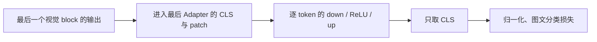

**逐层 CLIP Adapter 的 ProjRes 改进实验设计**

当前实现补充（2026-09-09）：候选表示已统一改用目标客户端的公开训练后端点。
FedAvg 为 `θ_start + Δ_target`，FedSGD 为 `θ_start - η g_target`，元数据记录
`representation_state: client_post_update_model`。以下轮初表示比较和漂移数值保留为
设计背景及历史诊断；插值网格、取多状态最小残差仍未启用。

日期：2026 年 9 月 9 日。实施更新：第一阶段最后层 down + CLS 已设为逐层 CLIP Adapter 的默认 ProjRes；未启动真实数据对照。按用户要求保留现有候选比例（FedAvg 1:1、FedSGD 1:10），第二阶段评分变体仍为设计。

**首选方案：最后一层视觉 Adapter 的 down 权重，配合该层输入的 CLS 表示。**

修改前首层 down + mean-token 的 ProjRes 与实际梯度贡献不够匹配。最后一层 Adapter 之后直接取 CLS 分类，patch 输出不再进入后续注意力，因此其 down 权重的损失梯度只由每张图的 CLS 贡献。这是最值得先验证的改动，比单独调整阈值或增大候选非成员数更直接。此结论来自当前 CLIP 前向结构和下述梯度验证；攻击成功率提升仍需真实实验。

**实验范围与现有基线**

固定当前逐层视觉 Adapter、12 层、reduction=2、原图/类别文本在线计算；FedAvg、uniform、10 客户端全参与、每轮 1 个完整本地 epoch、batch=32、学习率 0.01 恒定、16-shot、无防御。第一轮开发比较固定在 50 个通信轮，seed=42、目标客户端 0。成员仍是目标客户端完整原始训练集，不使用最后一个本地 batch 替代。

| 修改前首层 down + mean 基线 | CIFAR100 | Food101 |
|---|---:|---:|
| 50 轮成员 / 非成员 | 160 / 160 | 162 / 162 |
| 本地更新步数 / 轮 | 5 | 6，末批 2 条 |
| 50 轮 ProjRes AUC | 0.5558 | 0.5790 |
| 50 轮 TPR@1%FPR | 7.50% | 6.17% |
| 50 轮上传矩阵数值秩 | 381 | 384 |
| 上传矩阵形状 | 384×768 | 384×768 |
| 首层训练输入 token 数 | 8,000 | 8,100 |

这些基线来自 `2026-09-08_23-01-50-098380` 批次，详情见 [50/100 轮对比](/root/Privacy/analysis_scripts/clip_attack_diagnosis_20260908/transformer_adapter_50_vs_100.md)。按用户最新要求，所有 FedAvg 对照继续使用原 1:1 比例，隔离攻击层与表示变化，不扩大非成员池。

**为何最后一层 CLS 更符合梯度关系**

当前 forward 经过所有视觉 block 和各自 Adapter 后，CLIP 只执行 `last_hidden_state[:, 0, :]`，再做逐 token 的 LayerNorm、图像投影和图文相似度分类。最后 Adapter 本身的 down/ReLU/up 都逐 token 计算。



令 `G` 为被观察的负模型 delta（或任意一致非零缩放），输入向量采用行表示。首层的更新包含形如 `G = Σ_i Σ_t a_it h_it` 的 token 加权贡献，系数 `a_it` 为列向量；候选均值 `mean_t(h_it)` 一般不能与这个加权和视为同一个单向量关系。首层即使改成 CLS，真实更新中仍然含有 patch 的贡献。

最后一层 Adapter 的 patch 输出不影响损失，因此可写为：

`G_last = Σ_s Σ_{i∈B_s} a_i,s h_CLS,i(θ_s)`。

在当前每轮每个成员仅访问一次的无防御 SGD 设置下，可能参与梯度的输入向量从约 8,000 个 token 减为 160 个 CLS；Food101 对应从 8,100 减为 162。上传矩阵仍是 384×768。贡献数与矩阵维度因而进入更有利的范围：`160/162 ≤ 384`，且 `160/162 < 768`。

这只是有利的维度条件，不能替代非退化性要求。如果反向系数矩阵或表示矩阵不满相应的秩、部分样本梯度接近零，梯度行空间仍可能无法保留全部成员方向。[ProjRes 原论文](https://arxiv.org/html/2604.21197v1) §III-C 和 Appendix B 讨论了贡献向量数与输入/输出维度的关系；本设计将这套关系用于当前 CLIP 结构，不能直接沿用论文的效果数值。

另外，最后一层之前的 Adapter 会在本地更新，`h_CLS,i(θ_s)` 可能偏离轮初可计算的 `h_CLS,i(θ_0)`。这是最后层方案相对首层冻结输入的代价。FedAvg 仍保持 `paper_fedsgd_exact=false`、`batch_rank_bound=null`，不强制套用 32 或 160 的秩上限。多 epoch 时同一成员会产生多个状态下的向量，不能把上述贡献计数照搬过去。

**已完成的结构验证**

使用真实 Transformers CLIP 模块组成的 3 层小随机模型，在 CPU 完成一次 up 初始化更新后，检查普通 CE 的梯度。没有加载 CIFAR100/Food101，也没有 GPU 训练。

- 首层 patch 反向系数非零，只用 CLS 重建 down 梯度有约 3.30% 的相对误差。
- 最后一层 patch 反向系数为 0，CLS 外积重建的 down 梯度相对误差为 0。
- 现有 `get_projres_representations(..., token_reduction="cls")` 与 hook 捕获的最后 Adapter 输入 CLS 一致，且 CLS 随图像变化。
- 五步本地 SGD 的模型 delta 与各步梯度之和符合数值精度；实际访问时 CLS 与轮初 CLS 已出现约 0.98% 的相对漂移。这个漂移数值仅属于小模型，不是实际 CLIP 漂移估计。

可复现脚本：[verify_last_cls.py](/root/Privacy/analysis_scripts/projres_design_20260909/verify_last_cls.py)，记录：[last_cls_gradient_check.json](/root/Privacy/analysis_scripts/projres_design_20260909/last_cls_gradient_check.json)。这些检查证明计算路径和代数关系，不证明真实攻击有效率。

**第一阶段：只改变攻击层与 token 表示**

| 组别 | Adapter 层，代码索引 | 表示 | 作用 |
|---|---:|---|---|
| A | 0 | mean | 修改前基线 |
| B | 0 | CLS | 检查仅换 token 能否改善 |
| C | 11 | mean | 检查仅换层的效果 |
| D | 11 | CLS | 当前默认，匹配实际梯度贡献 |

四组都使用同一个负上传 delta 的行空间定义、现有 float64 SVD/QR 数值路径和原始负 L1 残差：

`score(x) = -||h(x) - h(x) Q Qᵀ||₁`，其中 Q 是该组被攻击矩阵的行空间正交基。

最小投入可以先运行 D 与 A 比较，通过后补齐 B/C 的消融。A 的历史 50 轮结果可作开发参照，但需要核对新旧数据、候选索引、训练曲线和代码版本；正式对照优先使用同版本的新 A。四组的候选池、模型训练和观察轮次必须相同，不能分别挑最有利的候选或停止轮。

以下配置已写入模型基线；null 按实际层数选择最后层，ViT-B/32 对应索引 11：

```yaml
projres:
  attacked_parameter: null
  token_reduction: cls
```

统一入口的完整干运行方式如下。删除 `--dry-run` 才启动训练；不指定 datasets 时依照当前 catalog 依次覆盖 CIFAR100、Food101。

```bash
python scripts/run_privacy_experiments.py \
  --models clip_adapter --methods fedavg --defenses none \
  --aggregation-weighting uniform --rounds 50 --attacks projres \
  --dry-run
```

已检查两数据集最终参数：50 轮、学习率 0.01、batch=32、16-shot、逐层 Adapter、在线特征、FedAvg/uniform、完整客户端候选，ProjRes 上限为 0/0/0。只选 ProjRes 可以省去其他攻击的逐样本求导；正式四组仍应使用同一攻击列表并核对训练状态一致性。

复现 A 时同时覆盖 `projres.attacked_parameter=clip_model.vision_model.encoder.layers.0.adapter.down.weight` 与 `projres.token_reduction=mean`。省略层名现在选择最后层，省略 token 配置或使用 auto 现在选择 CLS。

现有审计器一次仅支持一组 ProjRes 视图，以上命令能直接运行 D；不会自动在同一次训练中计算 A/B/C/D。若后续实现多视图审计，建议共享一次训练、一次目标 delta 和同一候选池，通过一次前向同时捕获首末层输入，并各自计算 mean/CLS，避免为了四个视图重复训练。各视图分别保存分数，默认 `projres` 结果不覆盖。

**第二阶段：根据第一阶段失败模式，逐项加入改进**

优先做无需额外前向的残差尺度消融。除原始 L1 外，并列保存：

`r_relative(x) = ||h - h Q Qᵀ||₁ / max(||h||₁, ε)`。

这能检查原始残差是否主要受候选表示幅度影响，不是单调等价变换，必须作为独立评分变体。核心 `projection_statistics` 已计算相对残差，但当前统一路径没有将它作为正式分数输出；需要接线和独立指标，不能把原始 ProjRes 的名字/结果偷偷改成新分数。

若换到最后 CLS 后成员残差仍偏大，再加入公开端点表示的比较。攻击者可见轮初模型 `θ_start` 和目标客户端完整 PEFT delta `Δ_target`，可构造三个公开可计算的模型状态：

`θ(λ) = θ_start + λ Δ_target`，固定 `λ ∈ {0, 0.5, 1}`。

在三个状态各自计算同一候选的 CLS，与同一观察上传的子空间投影。保留轮初单状态作为对照，再评估 `r(x)=min_λ r_relative(x;λ)`。它近似考虑未知的本地访问时点，但直线插值不等于真实 SGD 路径，取最小值也可能降低非成员残差。所有候选必须使用相同的 λ 集合，不能按照成员身份或真实 batch 顺序选状态。需要保存 `representation_state`、`state_grid` 和选中 λ 的分布。

这一变体仍可只观察一个通信轮，但利用了该客户端其他 Adapter 参数的上传来重建端点表示，应在威胁模型中明确，不能描述成“只使用一块 down 矩阵”。三次前向只发生在审计轮，特征仍在线计算，禁止跨模型状态混用缓存。

如果结果显示公共方向支配投影，再考虑用 bias 上传做一致的中心化。令独立开发参考池的表示均值为行向量 μ，`G_W` 和 `g_b` 分别为相同符号/单位的 down.weight、down.bias 更新：

`h_c = h - μ`，`G_c = G_W - g_b μ`。

由于 `g_b = Σ_i a_i`，上述变换满足 `G_c = Σ_i a_i(h_i-μ)`。不能只中心化候选而保留原梯度矩阵不变。μ 不用最终成员标签拟合，主实验使用独立固定参考池；该变体额外利用 bias 上传，单独记名。小模型已验证这个代数恒等式，真实区分收益未测。

数值秩只做诊断与有依据的敏感性分析。保留完整奇异值谱、默认容差、矩阵形状及有效秩；如果最后层仍出现高秩，先区分真实系数/表示变化与 float32 更新的舍入误差。float64 SVD 无法恢复上传前丢失的精度。不应为了提高指标直接将 FedAvg 秩固定为 batch=32、成员数或随意选 k；额外截断必须明确为经验变体，并在独立开发任务选规则。

**验证与选型规则**

- 第一阶段主指标为第 50 轮 TPR@1%FPR，辅助 AUC、成员/非成员残差分布、不同分数数量、数值秩、任务准确率和审计耗时。候选标签直方图、来源、ID 顺序、独立样本数都要校验。
- 先保持 A–D 原始 L1 评分一致；归一化、端点插值、中心化分别加入，不在一个实验中叠加后只报告最好值。每个变体保存独立列和定义。
- 开发使用已经查看过的 seed42/target0；正式验证冻结方案后选新 seeds 43/44/45 和至少两个预定目标客户端，例如 0/3。计算受限时先跑每个种子的 target0，再补另一个客户端。结果按训练任务报告，不能把重复轮次当独立实验。
- 按用户要求保留 `audit.nonmember_to_member_ratio=1`：CIFAR100 160/160、Food101 162/162。所有对照视图共享候选，报告 TPR@1%FPR 与 AUC 的任务间变化；1%FPR 仅允许约 1 个误报，须结合多种子结果判断。0.1%FPR 继续按照独立非成员数量判为不可报告。
- 成功标准是同样候选和训练下，D 在不同种子/客户端显示一致的 TPR 改善，且不是常量分数、数值截断或类别分布差异造成。现阶段不预设或承诺达到某个攻击百分比。

**实现边界和必要诊断**

第一阶段可使用现有 `TransformerAdapterClassifier.get_projres_attack_surface` 的任意 down 层选择与 CLIP 提取器的 CLS 支持。主要接线在 `servers/serverbase.py` 将 `projres.attacked_parameter/token_reduction` 传给共享审计器。无需改变模型训练结构。

历史 `signals.pt` 只保存首层残差和元数据，没有最后层的轮初参数、目标上传矩阵及候选隐藏表示；不能仅凭旧分数离线恢复 D。因此需要一次新的正常审计任务，或在未来任务中按需保存服务器本来可见的状态和更新后离线评分，不能为补录而改写旧结果。

提取器当前即使选择最后 CLS，仍返回“全部 token 数”，因此 `candidate_hidden_vector_count` 会继续显示 M×50。这是输入布局计数，不应误读为损失活跃贡献数。若增加诊断，应分开记录 `input_tokens_per_record=50` 与 `gradient_active_tokens_per_record=1`；只有经最后层 CLS 池化结构验证的组合能标记为 1。首层 CLS 不能据此改成每记录 1 个活跃 token。FedAvg 的 `batch_rank_bound` 始终保持 null。

多视图/端点实现需要验证共享骨干恢复、候选 ID 对齐、零上传跳过、float64 子空间正交性以及攻击关闭时训练不变。诊断真实本地中间表示只允许用于机制检查并单独标记，不能作为被动攻击输入。

暂不以减少 few-shot、仅选最后 batch、改 FedSGD、增大 local_epochs、冻结前 11 个 Adapter 等方法作为主方案。这些会改变训练或成员问题。其中“只训练最后 Adapter”可以作为后续隔离表示漂移的独立训练对照，不能计为同一模型上的攻击算法改进。

**建议的执行顺序**

先运行当前默认的最后层 down + CLS 的 50 轮对照；若有改善，补齐首/末层 × mean/CLS 消融，候选比例保持原样；若改善有限，先看数值秩和表示漂移，再依次测试相对残差与公开端点表示。中心化放在公共方向确实成为瓶颈时验证。
