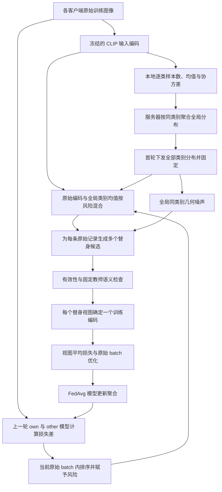

# 风险指导的全局类别分布多替身训练方案

本方案先利用冻结的 CLIP 输入编码，在各客户端原始训练集上计算逐类统计，由服务器在训练开始前聚合并下发全局类别均值与协方差；随后，每次客户端访问一个原始样本时，根据上一轮模型对该样本的损失差估计相对风险，用风险控制原始编码与全局类别均值之间的混合程度，再沿全局同类别的主要变化方向独立添加几何噪声，生成多个替身编码。替身经过固定教师的语义检查和数值有效性检查后，共同参与 Adapter 或 LoRA 的本地训练，并按原始样本归一化损失。整个训练过程以替身替换全部原始训练位置，原始数据仍在本地用于统计、风险计算和语义参照；目标是在保留类别判别信息的同时，降低训练更新对具体原始样本编码的依赖。

## 1. 方案范围与核心路线

本文描述当前“全局类别均值包含自身”的实现协议 `local_token_geometry_v11_no_norm_filter`。支持范围为 CLIP transformer Adapter / CLIP LoRA 与 FedAvg；本文中的“生成样本”指生成可送入视觉 Transformer 的虚拟 token 编码，不指生成可视化图片。

核心路线为：

**原始训练图像 → 冻结输入编码 → 首轮全局逐类分布 → 逐批风险估计 → 风险混合中心 → 全局同类几何扰动 → 语义检查 → 多替身共同训练 → FedAvg 聚合。**



全局分布是同一类别跨客户端的统计，不混合不同类别。参考中心直接使用全局类别均值，包含当前原始样本，不执行逐样本排除自身。所有客户端的同一类别共享相同参考中心和几何方向；每条样本的风险、混合后的位置及随机噪声可以不同。

本文用符号描述全部方法与训练超参数，不代入当前配置的具体取值。公式中的零、一、归一化因子及标准高斯分布属于数学定义，不代表超参数配置。

## 2. 符号与超参数

### 2.1 数据、模型与计算量

| 符号 | 含义 |
|---|---|
| \(K\)、\(C\) | 客户端总数、类别总数 |
| \(\mathcal D_k\) | 客户端 \(k\) 的原始训练集 |
| \(\mathcal D_{k,c}\)、\(n_{k,c}\) | 客户端 \(k\) 中类别 \(c\) 的原始训练子集及其样本数 |
| \(n_k\)、\(N_c\) | 客户端原始训练样本总数、全局类别 \(c\) 的原始样本总数 |
| \((x_{k,i},y_{k,i})\) | 客户端中的一条原始图像及标签 |
| \(h_{k,i}\in\mathbb R^d\) | 原始图像的 patch＋position token 展平编码 |
| \(\mu_{k,c},\Sigma_{k,c}\) | 本地类别均值与协方差 |
| \(\mu_c,\Sigma_c\) | 全局类别均值与协方差 |
| \(\lambda_{c,j},u_{c,j}\) | 全局类别协方差的特征值及对应单位特征向量 |
| \(\mathcal B_{k,t,s}\)、\(b_{k,t,s}\) | 第 \(t\) 轮第 \(s\) 个本地原始 batch 及其实际大小 |
| \(M_{k,i,t,s}\)、\(r_{k,i,t,s}\) | 原始损失差、由 batch 内排序得到的风险系数 |
| \(\theta\)、\(\phi\) | 当前训练模型参数、固定语义教师参数 |
| \(\epsilon_{k,i,t,s,v,a}\) | 某个视图、某次尝试独立抽取的标准高斯向量 |

均值、协方差、特征值和风险分数由数据或模型计算得到，不是需要人工指定的超参数。风险系数是相对排序量，不是经过校准的成员概率。

### 2.2 生成与风险超参数

| 符号 | 含义 | 对应实现 |
|---|---|---|
| \(\alpha>0\) | 几何噪声整体幅度 | `defense.synthesis.noise_scale` |
| \(q\) | 用于生成的全局类别几何秩上限 | `defense.synthesis.class_rank` |
| \(V\) | 每次原始样本访问实际用于训练的替身视图数 | `defense.synthesis.views_per_record` |
| \(A\) | 每个替身视图的最大候选尝试次数 | `defense.synthesis.attempts` |
| \(\rho\in(0,1)\) | batch 内参与递增风险赋值的高分尾部比例 | 生成训练分支中的风险尾部规则 |
| \(\tau\geq0\) | 教师语义间隔允许下降的容差 | `defense.synthesis.margin_tolerance` |
| \(n_{\min}\) | 全替换初始化要求的最小本地类内样本数 | `defense.synthesis.min_class_samples` |

其中 \(q,V,A,n_{\min}\) 是整数设置。\(V\) 与 \(A\) 的含义不同：前者决定共同训练多少个替身，后者决定每个替身最多尝试多少次生成。

**实现边界：**当前 `risk_synthesis` 的 \(\rho\) 在生成训练分支中固定，本文用符号表示该设计常量；它尚不是独立的 synthesis 配置项，不能通过修改 `defense.www_tail_fraction` 改变。本文也不把数值计算中的浮点保护常量解释为新的隐私或生成超参数。

### 2.3 训练与实验设置

| 符号 | 含义 |
|---|---|
| \(T\) | 通信轮数 |
| \(E\) | 每次参与训练时的完整本地 epoch 数 |
| \(B\) | 原始 batch 的配置大小；短 batch 使用实际大小 \(b_{k,t,s}\) |
| \(\eta_t\) | 第 \(t\) 轮学习率 |
| \(K_{\mathrm{part}}\) | 每轮参与客户端数 |
| \(S\) | 客户端划分前每类原始训练图像的抽样上限 |
| \(\omega_{k,t}\) | 本轮模型更新的聚合权重，当前按原始本地样本数计算 |

优化器、骨干、PEFT 结构、数据划分、随机种子与审计间隔沿用所选实验配置；比较生成机制时应保持这些设置一致。固定随机种子不构成隐私保证。

## 3. 在什么位置提取和替换编码

记冻结的 CLIP 输入嵌入模块为 \(g\)，图像转换为 token 序列：

\[
g(x_{k,i})=[h_{\mathrm{CLS}},h_{k,i,1},\ldots,h_{k,i,P}].
\]

其中各 patch token 已包含位置编码。用于统计和生成的向量为：

\[
h_{k,i}=\operatorname{vec}([h_{k,i,1},\ldots,h_{k,i,P}]).
\]

生成器修改展平的 patch＋position 编码，随后恢复 token 布局，并放回原有 CLS token。替身继续经过视觉 Transformer、图像投影及图文相似度分类。因此，本文的编码与 CLIP 最终图像 embedding 不同。

输入编码生成和候选选择不参与反向传播；视觉网络中的可训练 Adapter 或 LoRA 参数通过替身分类损失更新。被冻结的骨干和用于语义检查的固定教师不随该损失更新。

## 4. 首轮全局类别分布的建立

### 4.1 客户端从原始训练集计算逐类统计

在首次训练优化之前，每个客户端遍历自己的原始训练集，对每个存在的类别计算：

\[
\mu_{k,c}=\frac{1}{n_{k,c}}
\sum_{i:y_{k,i}=c}h_{k,i},
\]

\[
\Sigma_{k,c}=\frac{1}{n_{k,c}}
\sum_{i:y_{k,i}=c}
(h_{k,i}-\mu_{k,c})(h_{k,i}-\mu_{k,c})^T.
\]

协方差使用总体样本数作为除数。统计不使用 evaluation/test 分区，不使用生成的替身，也不按后续重复访问次数重新计数。

参与首轮分布统计的是全部已配置客户端，而不是仅第一个 mini-batch 或某次抽中的参与客户端。缺少某一类别的客户端不贡献该类统计，但仍获得服务器下发的全部全局类别分布。当前全替换实现还要求每个存在的本地类别满足 \(n_{\min}\) 条件；拥有全局统计不会自动取消这一检查。

### 4.2 服务器按类别聚合

全局类别样本数和均值为：

\[
N_c=\sum_k n_{k,c},\qquad
\mu_c=\sum_{k:n_{k,c}>0}\frac{n_{k,c}}{N_c}\mu_{k,c}.
\]

全局协方差按全协方差分解计算：

\[
\boxed{
\Sigma_c=
\sum_{k:n_{k,c}>0}\frac{n_{k,c}}{N_c}
\left[\Sigma_{k,c}
+(\mu_{k,c}-\mu_c)(\mu_{k,c}-\mu_c)^T\right]
}
\]

第一项保留客户端内部的同类变化，第二项保留不同客户端同类均值之间的变化。只平均本地协方差会漏掉后一部分。

这里的权重由每个客户端的当前类别样本数决定，与训练时的模型更新聚合权重分开计算。整个过程只合并同一类别，不加入本地跨类别合并协方差或相应收缩系数。

### 4.3 用协方差因子避免高维稠密矩阵

输入 token 展平后的维度较高，因此客户端上传满足下式的数值谱因子：

\[
\Sigma_{k,c}\approx F_{k,c}F_{k,c}^{T}.
\]

近似来自浮点精度和数值零方向的剔除，不来自预先按生成秩 \(q\) 截断。服务器可以拼接加权因子和均值偏移列：

\[
G_c=\left[
\sqrt{w_{k,c}}F_{k,c},\;
\sqrt{w_{k,c}}(\mu_{k,c}-\mu_c)
\right]_{k:n_{k,c}>0},
\qquad w_{k,c}=\frac{n_{k,c}}{N_c},
\]

使得 \(G_cG_c^T\approx\Sigma_c\)。服务器基于这个表示获得完整数值秩的全局协方差因子和谱信息，避免构造稠密的 \(d\times d\) 矩阵。

**先聚合完整数值秩的本地统计，再截断生成方向。** 提前把每个客户端的协方差裁成 \(q\) 个方向，会改变所聚合的全局统计。

### 4.4 下发并固定全局分布

每个客户端获得所有全局存在类别的 \(N_c,\mu_c,\Sigma_c\) 的因子表示与谱信息。当前统计交换在首轮优化前执行一次，后续训练不重新估计或下发这些分布。

\(\mu_c\) 包含当前原始样本，该样本对类别均值的贡献为 \(1/N_c\)。参考中心不因当前原始样本身份而变化，也不扣除整个目标客户端。

仓库使用单进程模拟客户端与服务器：各客户端持有同一份分布映射，并保存独立接收回执。这是统计上传和广播的程序实现，不是新增的跨机器网络通信框架。

## 5. 每次训练访问的风险如何计算

### 5.1 使用上一轮 own / other 参考状态

当前原始 batch 中的每条记录，分别在两个参考模型上计算真实标签交叉熵：

\[
M_{k,i,t,s}=
\ell(\vartheta^{\mathrm{other}}_{k,t};x_{k,i},y_{k,i})
-\ell(\vartheta^{\mathrm{own}}_{k,t};x_{k,i},y_{k,i}).
\]

\(\vartheta^{\mathrm{own}}_{k,t}\) 为上一轮该客户端训练后的参考参数；\(\vartheta^{\mathrm{other}}_{k,t}\) 是按上一轮实际聚合权重，从上一轮聚合结果中扣除该客户端贡献后得到的其他参与客户端参数聚合状态。若上一轮该客户端权重为 \(a_k\)，则：

\[
\vartheta^{\mathrm{other}}_{k,t}
=\frac{\vartheta^{\mathrm{global}}_{t-1}
-a_k\vartheta^{\mathrm{own}}_{k,t}}{1-a_k}.
\]

损失差越大，表示 own 参考模型相对于 other 参考模型更擅长该样本。本方案用它作为潜在个体依赖的经验信号，不将其解释为真实隐私泄漏概率。

两个参考状态来自先前训练过程，other 模型不是严格从未接触目标客户端数据的模型。风险计算使用原始图像，采用评估模式且停止梯度；计算结束后恢复当前本地训练状态。

### 5.2 在当前原始 batch 内转换为风险系数

对当前 batch 的损失差稳定升序排列。令实际 batch 大小为 \(b\)，尾部长度为：

\[
m=\lceil\rho b\rceil.
\]

尾部之外的记录赋值 \(r_i=0\)。对于尾部内部从低到高的第 \(j\) 条记录：

\[
r_i=\frac{j-\tfrac12}{m},\qquad j=1,\ldots,m.
\]

同分记录保留 batch 内的原顺序，短 batch 按实际大小计算尾部。风险在同一个原始 batch 的所有替身视图间共享，不为每个视图重复排序。

首轮或缺少上一轮有效参考状态时，令该次访问的全部风险为零。此时仍执行全替换和几何扰动，不把缺少风险解释为允许使用原始编码训练。

当前主路线采用本轮 batch 的损失差排序，不启用累积暴露历史或最小本地近邻相似度候选选择。这些是已有可选研究对照，不能混入本文主公式。

## 6. 多替身候选的生成公式

### 6.1 从全局协方差获得生成因子

对类别 \(c\) 的全局协方差进行特征分解，按特征值降序取：

\[
q_c=\min(q,\operatorname{rank}_{\mathrm{num}}(\Sigma_c)),
\qquad
L_c=U_{c,1:q_c}\Lambda_{c,1:q_c}^{1/2}.
\]

这里 \(q\) 只控制生成时使用的方向数，服务器下发的全局分布仍保留完整数值秩表示。所有客户端使用相同类别的同一组方向。

### 6.2 风险控制加噪前的位置

对原始编码 \(h_{k,i}\) 及其类别 \(c=y_{k,i}\)，加噪前的位置为：

\[
\bar h_{k,i,t,s}
=(1-r_{k,i,t,s})h_{k,i}+r_{k,i,t,s}\mu_c.
\]

低风险访问更靠近原始编码，高风险访问更靠近全局类别均值。\(\mu_c\) 是所有同类样本共享的参考中心；\(\bar h_{k,i,t,s}\) 则通常随样本和风险而变化。

由于全局均值包含自身，风险控制的是原始编码的**直接混合项**。即使将风险取到理论端点，原始样本仍对均值和协方差有贡献，不能将其描述为完全消除了原样本信息。

### 6.3 为每个视图独立采样

对每条原始记录生成 \(V\) 个训练视图，每个视图最多尝试 \(A\) 个候选：

\[
\epsilon_{k,i,t,s,v,a}\sim\mathcal N(0,I_{q_c}),
\]

\[
\boxed{
\tilde h^{(a)}_{k,i,t,s,v}
=(1-r_{k,i,t,s})h_{k,i}
+r_{k,i,t,s}\mu_c
+\alpha L_c\epsilon_{k,i,t,s,v,a}
}
\]

同一原始记录的各视图使用相同的风险、中心和协方差因子，但独立抽取噪声。下一次训练访问会重新生成视图；并非为每张原图永久固定一组替身。

### 6.4 噪声缩放的含义

在给定原始编码、风险和全局统计，且尚未进行候选筛选时：

\[
\mathbb E[\tilde h^{(a)}_{i,v}]=\bar h_i,
\qquad
\operatorname{Cov}(\tilde h^{(a)}_{i,v})
=\alpha^2U_{c,1:q_c}\Lambda_{c,1:q_c}U_{c,1:q_c}^{T}.
\]

\(u_{c,j}\) 决定扰动方向，\(\sqrt{\lambda_{c,j}}\) 决定沿该方向的类别标准差尺度，\(\alpha\) 决定整体扰动幅度；\(\alpha\) 同时缩放所有保留方向，而 \(r_i\) 控制生成位置。这两个作用相互独立。

\(\alpha\) 是经验设计参数，不是论文公式要求的常数，也不是经过隐私预算校准的噪声乘数。增大它会扩大候选分布，但不能据此断言攻击效果一定下降；也可能增加语义失败或降低分类效用。候选通过重试和筛选后，最终训练视图的分布一般不再等于上式对应的未筛选高斯分布。

## 7. 候选有效性和语义检查

### 7.1 数值与结构条件

每个候选都必须满足：编码有限；实际改变了原始编码；与同一原始记录已经选出的其他训练视图不同。判定在候选转换为实际输入数据类型后执行，避免高精度中的变化在实际训练输入中消失。

范数比仅记录为诊断量：

\[
\eta(h,\tilde h)=\frac{\|\tilde h\|_2}{\max(\|h\|_2,\varepsilon_{\mathrm{num}})}.
\]

其中 \(\varepsilon_{\mathrm{num}}\) 是避免除零的数值保护量。当前全替换方案不按这个比例拒绝、缩放或裁剪候选，不再设置范数上下界。全局类别均值可能因不同样本方向抵消而具有较小范数，混合后的幅度减小并不等于类别语义失效；类别语义仍由固定教师检查。旧版本的范数约束保留在历史代码和结果解释中。

### 7.2 固定教师检查类别语义

使用固定原始 CLIP 教师 \(\phi\)，得到候选的最终图像特征，并与固定类别文本特征计算归一化余弦相似度 \(s_c(h;\phi)\)。定义真实类别相对其他类别的间隔：

\[
\gamma(h,y;\phi)=s_y(h;\phi)-\max_{c\ne y}s_c(h;\phi).
\]

候选的语义条件为：

\[
\gamma(\tilde h,y;\phi)
\geq\gamma(h,y;\phi)-\tau.
\]

这要求候选相对原始编码的教师类别间隔不要下降过多，不要求原样本或候选一定被教师正确分类。该检查是相对语义稳定性的经验约束，不是语义完全正确的证明。

固定语义教师与风险计算的 own / other 模型不同：教师用于检查类别语义，始终冻结；own / other 是上一轮训练参考状态，用于计算样本风险。

### 7.3 每个视图选择一个训练候选

当前主路线使用“首个语义合格候选”：对某个视图依次尝试，遇到满足有效性和语义条件的候选即停止该视图的重试。

若尝试耗尽后仍无语义合格候选，但存在数值有效、真正改变且与已选视图不同的候选，则保留其中教师语义间隔最高的一个，记录 `quality_passed=false`；同分保留较早尝试。不能回退到原图或原始编码。

若某个视图始终没有有效候选，则在该原始 batch 的优化之前报错。所有原始记录的全部 \(V\) 个训练视图准备好后，才进入反向传播。

因此，一条原始记录最终使用 \(V\) 个训练替身，候选尝试数最多为 \(VA\)。候选数、视图数和原始记录数是不同的统计单位。

## 8. 多替身共同训练与 FedAvg

### 8.1 按原始样本归一化损失

对于包含 \(b\) 条原始记录的 batch，训练目标为：

\[
\boxed{
\mathcal L_{k,t,s}(\theta)
=\frac1b\sum_{i\in\mathcal B_{k,t,s}}
\frac1V\sum_{v=1}^{V}
\operatorname{CE}(f_\theta(\tilde h_{k,i,t,s,v}),y_{k,i})
}
\]

每个替身沿用原始类别标签。当前损失仅使用替身上的普通交叉熵，不额外加入 WWW 概率差正则、风险损失乘数或按视图重复的原图交叉熵项。

代码逐视图前向并累积除以 \(V\) 的梯度，最后对整个原始 batch 执行一次 optimizer step。这样可以控制激活显存，同时保持“视图平均后、原始记录平均”的梯度归一化。不能先平均多个替身编码再前向，因为网络通常是非线性的。

增加 \(V\) 会增加训练计算量，但不会增加本地 epoch 数、原始 batch 的优化步数或原始记录的聚合权重。

### 8.2 FedAvg 上传和聚合

客户端完成 \(E\) 个本地 epoch 后，上传可训练参数的模型差值：

\[
\Delta\theta_{k,t}=\theta^{\mathrm{local}}_{k,t}-\theta_t.
\]

对本轮参与集合 \(\mathcal S_t\)，服务器按原始本地样本数聚合：

\[
\omega_{k,t}=\frac{n_k}{\sum_{j\in\mathcal S_t}n_j},
\qquad
\theta_{t+1}=\theta_t+\sum_{k\in\mathcal S_t}\omega_{k,t}\Delta\theta_{k,t}.
\]

这里的 \(n_k\) 不乘替身视图数，也不按重复本地 epoch 扩大。固定全局类别统计继续用于后续生成；上一轮客户端状态和聚合结果用于下一轮可用的风险参考。

## 9. 完整执行流程

```text
输入：各客户端原始训练集、冻结输入编码模块、可训练 PEFT 模型、固定语义教师
超参数：α、q、V、A、ρ、τ、n_min，以及训练协议参数

初始化：
    各客户端提取原始训练图像的 patch＋position 编码。
    各客户端逐类计算样本数、均值及完整数值秩协方差因子。
    服务器按同类别样本数聚合均值、类内协方差和客户端均值差异项。
    下发所有全局类别分布，并固定这些统计。
    从各类完整全局统计中提取最多 q 个生成方向。

对每一通信轮：
    在覆盖客户端参数前，为存在上一轮有效状态的客户端准备 own / other 参考。
    向参与客户端同步轮初模型。
    各客户端按既定本地 epoch 和原始 batch 顺序训练：
        在当前原始 batch 上计算损失差并转换为风险；缺少参考则风险置零。
        每条原始记录的全部视图共享其本次风险。
        对每条记录的每个训练视图：
            使用包含自身的全局类别均值构建风险混合位置。
            独立采样全局同类几何噪声，最多尝试 A 次。
            选首个合格候选；全部语义失败时保留语义最佳有效候选。
            若没有有效候选，则在 batch 优化前报错。
        所有 V 个训练视图准备完成后：
            累积视图平均的交叉熵梯度。
            对该原始 batch 执行一次 optimizer step。
            记录成功训练的原始访问与全部训练视图。
    上传客户端可训练参数差值，并按原始本地样本数执行 FedAvg。
    按实验协议执行评估和成员推理审计。
```

## 10. 与原论文的关系及设计动机

全局类别均值和协方差的聚合采用 Ma 等论文的同类别统计聚合思路。原论文单域生成算法在 CLIP 最终图像 embedding 上围绕原样本添加全局几何噪声，之后用原有与新增 embedding 训练 MLP，其噪声公式使用协方差特征值本身作为方向系数。[原文 §3.1、§3.2.1 与算法 1](https://openaccess.thecvf.com/content/CVPR2025/papers/Ma_Geometric_Knowledge-Guided_Localized_Global_Distribution_Alignment_for_Federated_Learning_CVPR_2025_paper.pdf)

| 环节 | 原论文单域方案 | 当前方案 |
|---|---|---|
| 主要目标 | 改善异构数据下的分布对齐和学习效用 | 研究风险指导替换对成员推理与效用的影响 |
| 生成空间 | CLIP 最终图像 embedding | 输入 patch＋position token |
| 加噪前的位置 | 原始样本编码 | 原始编码与全局类别均值按风险混合 |
| 噪声形式 | \(U_c\Lambda_c\epsilon\) | \(\alpha U_{c,1:q_c}\Lambda_{c,1:q_c}^{1/2}\epsilon\) |
| 原始样本使用 | 原有与新增 embedding 用于训练 | 原始训练位置全部由替身承担训练损失 |
| 候选筛选 | 生成算法不含本文的语义重试 | 固定教师检查，逐视图确定训练候选 |
| 训练模型 | embedding 后的 MLP | 视觉 Transformer 中的 Adapter / LoRA |

当前各组成部分承担不同作用：全局类别均值提供共享参考位置；风险控制原始编码的直接占比；全局协方差提供与同类变化相关的扰动方向；\(\alpha\) 控制幅度；\(q\) 限制生成方向数；语义检查约束候选的类别间隔变化；\(V\) 个视图让一次原始访问由多个替身共同承担。

这些都是待验证的设计动机，不等于每个组件已证明有效。特别是低秩、噪声幅度和语义筛选会共同改变候选分布，最终样本不保证精确服从原始全局类别分布，也不保证一定减少成员推理风险。

## 11. 信息共享、成员身份与验证边界

首轮上传的统计包括逐类样本数、均值和协方差因子；不上传用于聚合的逐记录图像、编码或记录身份向量。原始编码、风险计算和替身生成留在客户端侧。这里“统计不含逐记录编码字段”并不意味着这些统计没有信息泄漏。

全部替换表示不把原图或原编码直接作为该分支的训练损失输入。原始数据仍用于首轮统计、风险计算和语义参照；全局均值和协方差也包含训练成员贡献。

FedAvg 成员身份仍定义为目标客户端原始完整训练集中的记录。替身数量增加不会增加成员池、独立 evaluation 非成员池或低 FPR 的统计分辨率。成员推理仍评价原始样本身份，不把生成视图当成新的独立成员。

目前已完成实现与协议测试，包括全局矩与中央计算一致、全局均值包含自身、跨客户端同类参考中心一致、多视图梯度归一化、语义失败处理、统计回执核验，以及 Adapter / LoRA 训练与攻击接口集成。当前最新版尚无完整真实数据实验支持其准确率收益、隐私收益或超参数最优性；历史局部几何版本的效果不能直接作为当前版本的效果。

本方案不提供形式差分隐私保证。\(\alpha\) 未根据敏感度和隐私会计校准；首轮共享统计也没有 DP 保护。现有成员推理攻击尚未把这些共享统计纳入完整攻击视图，因此原有攻击指标不能单独代表新协议整体的隐私表现。

后续效果评价应同时核对任务效用、成员推理指标、语义失败比例、原始访问和训练视图计数、生成与训练耗时，并在一致的数据身份和训练协议下比较各配置。对 \(\alpha,q,V\) 等参数的选择应依据明确的对照结果，而非仅凭扰动更大或生成更多样本推断保护更强。

## 12. 实现对应与文档依据

本文依据 `/root/Privacy` 的 `main` 当前实现：在包含自身的全局类别均值协议上，2026-09-14 移除了全替换候选的范数门槛，记录为 v11；历史 v10 对应提交 `6337b87`，正式目录整合对应 `5b980ca`。正文不罗列具体超参数取值，也不将旧工作树或历史实验配置视为当前默认。

| 内容 | 对应文件 |
|---|---|
| 输入 token 提取及前向 | [clip_tokens.py](/root/Privacy/trainmodel/clip_tokens.py) |
| 本地统计、全局聚合与广播 | [global_geometry.py](/root/Privacy/privacy_defenses/global_geometry.py) |
| 风险混合位置、采样、语义重试、多视图生成 | [risk_synthesis.py](/root/Privacy/privacy_defenses/risk_synthesis.py) |
| 原始损失差和其他客户端参考重建 | [www.py](/root/Privacy/privacy_defenses/www.py) |
| 尾部秩风险映射 | [www_dp.py](/root/Privacy/privacy_defenses/www_dp.py) |
| 风险生成训练与视图平均优化 | [controller.py](/root/Privacy/privacy_defenses/controller.py) |
| 模型能力、方法及防御配置 | [experiment_catalog.yaml](/root/Privacy/configs/experiment_catalog.yaml) |
| 统一实验入口 | [run_privacy_experiments.py](/root/Privacy/scripts/run_privacy_experiments.py) |
| 多替身入口的稳定设置 | [run_synthesis_multiview.py](/root/Privacy/scripts/run_synthesis_multiview.py) |

当前主路线的协议选择是全局分布用于生成、全局均值作为中心、全部替换、均匀类别中心、当前风险排序、首个语义合格候选以及多视图共同训练。`views_per_record` 的通用配置基线与多替身入口设置应区分，实际运行以统一入口解析后的配置为准；本文统一用 \(V\) 表示最终实际训练视图数。
