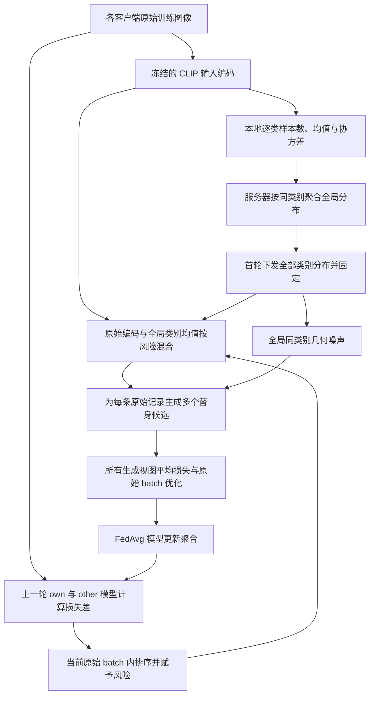

# 风险指导的全局类别分布多替身训练方案

本方案先利用冻结的 CLIP 输入编码，在各客户端原始训练集上计算逐类统计，由服务器在训练开始前聚合并下发全局类别均值与协方差；随后，每次客户端访问一个原始样本时，根据上一轮模型对该样本的损失差估计相对风险，用风险控制原始编码与全局类别均值之间的混合程度，再沿全局同类别的主要变化方向独立添加几何噪声，生成多个替身编码。每个替身只抽样一次，直接共同参与 Adapter 或 LoRA 的本地训练，并按原始样本归一化损失；不做候选有效性、去重或教师语义检查。整个训练过程以替身替换全部原始训练位置，原始数据仍在本地用于统计、风险计算；目标是在保留类别判别信息的同时，降低训练更新对具体原始样本编码的依赖。

## 1. 方案范围与核心路线

本文描述当前“全局类别均值包含自身、噪声无额外缩放系数”的实现协议 `local_token_geometry_v13_direct_unit_noise`。支持范围为 CLIP transformer Adapter / CLIP LoRA；direct 模式支持 FedAvg/FedSGD。下文聚合及完整训练集成员描述以 FedAvg 为例，FedSGD 的单 batch 上传与原始来源成员定义见 [FedSGD 支持说明](risk_synthesis_fedsgd.md)。本文中的“生成样本”指生成可送入视觉 Transformer 的虚拟 token 编码，不指生成可视化图片。

后续用户要求尝试0.5噪声，新增显式幅度对照v14：设置 `defense.synthesis.noise_scale=0.5` 时，以下噪声项改为 \(0.5L_c\epsilon\)，条件协方差为约 \(0.25\Sigma_c\)。不传此选项时，本文的默认v13公式不变。完整试验设置见 [0.5噪声对照](risk_synthesis_noise_half.md)。

核心路线为：

**原始训练图像 → 冻结输入编码 → 首轮全局逐类分布 → 逐批风险估计 → 风险混合中心 → 全局同类几何扰动 → 全部生成视图直接共同训练 → FedAvg 聚合。**



全局分布是同一类别跨客户端的统计，不混合不同类别。参考中心直接使用全局类别均值，包含当前原始样本，不执行逐样本排除自身。所有客户端的同一类别共享相同参考中心和几何方向；每条样本的风险、混合后的位置及随机噪声可以不同。

本文用符号描述全部方法与训练超参数，不代入当前配置的具体取值。公式中的零、一、归一化因子及标准高斯分布属于数学定义，不代表超参数配置。

## 2. 符号与超参数

### 2.1 数据、模型与计算量

| 符号 | 含义 |
|---|---|
| \(K\)、\(C\) | 客户端总数、类别总数 |
| \(\mathcal D_k\) | 客户端 \(k\) 的原始训练集 |
| \(\mathcal D_{k,c}\)、\(n_{k,c}\) | 客户端 \(k\) 中类别 \(c\) 的原始训练子集及其样本数 |
| \(n_k\)、\(N_c\) | 客户端原始训练样本总数、全局类别 \(c\) 的原始样本总数 |
| \((x_{k,i},y_{k,i})\) | 客户端中的一条原始图像及标签 |
| \(h_{k,i}\in\mathbb R^d\) | 原始图像的 patch＋position token 展平编码 |
| \(\mu_{k,c},\Sigma_{k,c}\) | 本地类别均值与协方差 |
| \(\mu_c,\Sigma_c\) | 全局类别均值与协方差 |
| \(\lambda_{c,j},u_{c,j}\) | 全局类别协方差的特征值及对应单位特征向量 |
| \(\mathcal B_{k,t,s}\)、\(b_{k,t,s}\) | 第 \(t\) 轮第 \(s\) 个本地原始 batch 及其实际大小 |
| \(M_{k,i,t,s}\)、\(r_{k,i,t,s}\) | 原始损失差、由 batch 内排序得到的风险系数 |
| \(\theta\) | 当前训练模型参数 |
| \(\epsilon_{k,i,t,s,v}\) | 某个视图独立抽取的标准高斯向量 |

均值、协方差、特征值和风险分数由数据或模型计算得到，不是需要人工指定的超参数。风险系数是相对排序量，不是经过校准的成员概率。

### 2.2 生成与风险超参数

| 符号 | 含义 | 对应实现 |
|---|---|---|
| \(V\) | 每次原始样本访问实际用于训练的替身视图数 | `defense.synthesis.views_per_record` |
| \(\rho\in(0,1]\) | batch 内参与递增风险赋值的高分尾部比例 | `defense.synthesis.risk_tail_fraction` |

其中 \(V\) 是正整数设置。生成采用全部数值有效方向（`defense.synthesis.class_rank: all`），方向数由类别数据决定，不再设置秩上限。噪声直接为 \(L_c\epsilon\)，没有额外幅度参数。每个视图只抽样一次，生成的全部 \(V\) 个候选均参加训练；不再设置重试预算、语义容差或候选最小本地类别样本数。

**风险覆盖比例（2026-09-28更新）：**direct生成使用独立的 `defense.synthesis.risk_tail_fraction`，范围为 `(0,1]`，catalog新实验默认1。取1时，有参考状态的整个原始batch按排序获得 `(j-0.5)/b` 的不同权重，权重不会全部变成1；首轮或缺少参考时仍全为0。未含此项的旧配置继续使用0.8，复现旧入口设置可显式传 `--set defense.synthesis.risk_tail_fraction=0.8`。`defense.www_tail_fraction` 属于独立WWW防御，不控制生成分支。

### 2.3 训练与实验设置

| 符号 | 含义 |
|---|---|
| \(T\) | 通信轮数 |
| \(E\) | 每次参与训练时的完整本地 epoch 数 |
| \(B\) | 原始 batch 的配置大小；短 batch 使用实际大小 \(b_{k,t,s}\) |
| \(\eta_t\) | 第 \(t\) 轮学习率 |
| \(K_{\mathrm{part}}\) | 每轮参与客户端数 |
| \(S\) | 客户端划分前每类原始训练图像的抽样上限 |
| \(\omega_{k,t}\) | 本轮模型更新的聚合权重，当前按原始本地样本数计算 |

优化器、骨干、PEFT 结构、数据划分、随机种子与审计间隔沿用所选实验配置；比较生成机制时应保持这些设置一致。固定随机种子不构成隐私保证。

## 3. 在什么位置提取和替换编码

记冻结的 CLIP 输入嵌入模块为 \(g\)，图像转换为 token 序列：

\[
g(x_{k,i})=[h_{\mathrm{CLS}},h_{k,i,1},\ldots,h_{k,i,P}].
\]

其中各 patch token 已包含位置编码。用于统计和生成的向量为：

\[
h_{k,i}=\operatorname{vec}([h_{k,i,1},\ldots,h_{k,i,P}]).
\]

生成器修改展平的 patch＋position 编码，随后恢复 token 布局，并放回原有 CLS token。替身继续经过视觉 Transformer、图像投影及图文相似度分类。因此，本文的编码与 CLIP 最终图像 embedding 不同。

输入编码与候选生成不参与反向传播；视觉网络中的可训练 Adapter 或 LoRA 参数通过替身分类损失更新。骨干原有权重冻结；当前不创建用于语义筛选的教师副本。

## 4. 首轮全局类别分布的建立

### 4.1 客户端从原始训练集计算逐类统计

在首次训练优化之前，每个客户端遍历自己的原始训练集，对每个存在的类别计算：

\[
\mu_{k,c}=\frac{1}{n_{k,c}}
\sum_{i:y_{k,i}=c}h_{k,i},
\]

\[
\Sigma_{k,c}=\frac{1}{n_{k,c}}
\sum_{i:y_{k,i}=c}
(h_{k,i}-\mu_{k,c})(h_{k,i}-\mu_{k,c})^T.
\]

协方差使用总体样本数作为除数。统计不使用 evaluation/test 分区，不使用生成的替身，也不按后续重复访问次数重新计数。

参与首轮分布统计的是全部已配置客户端，而不是仅第一个 mini-batch 或某次抽中的参与客户端。缺少某一类别的客户端不贡献该类统计，但仍获得服务器下发的全部全局类别分布。直接生成不再按最小本地类别样本数拒绝候选。全局中心直接使用全局该类均值；显式本地中心对照在该类只有一条记录时使用本地均值。

### 4.2 服务器按类别聚合

全局类别样本数和均值为：

\[
N_c=\sum_k n_{k,c},\qquad
\mu_c=\sum_{k:n_{k,c}>0}\frac{n_{k,c}}{N_c}\mu_{k,c}.
\]

全局协方差按全协方差分解计算：

\[
\boxed{
\Sigma_c=
\sum_{k:n_{k,c}>0}\frac{n_{k,c}}{N_c}
\left[\Sigma_{k,c}
+(\mu_{k,c}-\mu_c)(\mu_{k,c}-\mu_c)^T\right]
}
\]

第一项保留客户端内部的同类变化，第二项保留不同客户端同类均值之间的变化。只平均本地协方差会漏掉后一部分。

这里的权重由每个客户端的当前类别样本数决定，与训练时的模型更新聚合权重分开计算。整个过程只合并同一类别，不加入本地跨类别合并协方差或相应收缩系数。

### 4.3 用协方差因子避免高维稠密矩阵

输入 token 展平后的维度较高，因此客户端上传满足下式的数值谱因子：

\[
\Sigma_{k,c}\approx F_{k,c}F_{k,c}^{T}.
\]

近似来自浮点精度和数值零方向的剔除，不来自人为截断方向。服务器可以拼接加权因子和均值偏移列：

\[
G_c=\left[
\sqrt{w_{k,c}}F_{k,c},\;
\sqrt{w_{k,c}}(\mu_{k,c}-\mu_c)
\right]_{k:n_{k,c}>0},
\qquad w_{k,c}=\frac{n_{k,c}}{N_c},
\]

使得 \(G_cG_c^T\approx\Sigma_c\)。服务器基于这个表示获得完整数值秩的全局协方差因子和谱信息，避免构造稠密的 \(d\times d\) 矩阵。

**聚合和生成均保留完整数值秩，不再只取主要方向。** 零特征值方向不产生噪声，无需构造；实现继续剔除数值零方向。

### 4.4 下发并固定全局分布

每个客户端获得所有全局存在类别的 \(N_c,\mu_c,\Sigma_c\) 的因子表示与谱信息。当前统计交换在首轮优化前执行一次，后续训练不重新估计或下发这些分布。

\(\mu_c\) 包含当前原始样本，该样本对类别均值的贡献为 \(1/N_c\)。参考中心不因当前原始样本身份而变化，也不扣除整个目标客户端。

仓库使用单进程模拟客户端与服务器：各客户端持有同一份分布映射，并保存独立接收回执。这是统计上传和广播的程序实现，不是新增的跨机器网络通信框架。

## 5. 每次训练访问的风险如何计算

### 5.1 使用上一轮 own / other 参考状态

当前原始 batch 中的每条记录，分别在两个参考模型上计算真实标签交叉熵：

\[
M_{k,i,t,s}=
\ell(\vartheta^{\mathrm{other}}_{k,t};x_{k,i},y_{k,i})
-\ell(\vartheta^{\mathrm{own}}_{k,t};x_{k,i},y_{k,i}).
\]

\(\vartheta^{\mathrm{own}}_{k,t}\) 为上一轮该客户端训练后的参考参数；\(\vartheta^{\mathrm{other}}_{k,t}\) 是按上一轮实际聚合权重，从上一轮聚合结果中扣除该客户端贡献后得到的其他参与客户端参数聚合状态。若上一轮该客户端权重为 \(a_k\)，则：

\[
\vartheta^{\mathrm{other}}_{k,t}
=\frac{\vartheta^{\mathrm{global}}_{t-1}
-a_k\vartheta^{\mathrm{own}}_{k,t}}{1-a_k}.
\]

损失差越大，表示 own 参考模型相对于 other 参考模型更擅长该样本。本方案用它作为潜在个体依赖的经验信号，不将其解释为真实隐私泄漏概率。

两个参考状态来自先前训练过程，other 模型不是严格从未接触目标客户端数据的模型。风险计算使用原始图像，采用评估模式且停止梯度；计算结束后恢复当前本地训练状态。

### 5.2 在当前原始 batch 内转换为风险系数

对当前 batch 的损失差稳定升序排列。令实际 batch 大小为 \(b\)，尾部长度为：

\[
m=\lceil\rho b\rceil.
\]

尾部之外的记录赋值 \(r_i=0\)。对于尾部内部从低到高的第 \(j\) 条记录：

\[
r_i=\frac{j-\tfrac12}{m},\qquad j=1,\ldots,m.
\]

同分记录保留 batch 内的原顺序，短 batch 按实际大小计算尾部。风险在同一个原始 batch 的所有替身视图间共享，不为每个视图重复排序。

首轮或缺少上一轮有效参考状态时，令该次访问的全部风险为零。此时仍执行同一生成公式；若几何退化或浮点舍入导致结果与原编码相同，也直接采用，不进行额外检查。

当前主路线采用本轮 batch 的损失差排序，不启用累积暴露历史或最小本地近邻相似度候选选择。这些是已有可选研究对照，不能混入本文主公式。

## 6. 多替身候选的生成公式

### 6.1 从全局协方差获得生成因子

对类别 \(c\) 的全局协方差进行特征分解，按特征值降序取：

\[
q_c=\operatorname{rank}_{\mathrm{num}}(\Sigma_c),
\qquad
L_c=U_{c,1:q_c}\Lambda_{c,1:q_c}^{1/2}.
\]

这里 \(q_c\) 是从数据计算出的完整数值秩，不是超参数。所有客户端使用相同类别的全部有效方向，生成因子与下发的完整协方差因子一致；\(q_c\leq\min(d,N_c-1)\)。

### 6.2 风险控制加噪前的位置

对原始编码 \(h_{k,i}\) 及其类别 \(c=y_{k,i}\)，加噪前的位置为：

\[
\bar h_{k,i,t,s}
=(1-r_{k,i,t,s})h_{k,i}+r_{k,i,t,s}\mu_c.
\]

低风险访问更靠近原始编码，高风险访问更靠近全局类别均值。\(\mu_c\) 是所有同类样本共享的参考中心；\(\bar h_{k,i,t,s}\) 则通常随样本和风险而变化。

由于全局均值包含自身，风险控制的是原始编码的**直接混合项**。即使将风险取到理论端点，原始样本仍对均值和协方差有贡献，不能将其描述为完全消除了原样本信息。

### 6.3 为每个视图独立采样

对每条原始记录直接生成 \(V\) 个训练视图，各视图各抽样一次：

\[
\epsilon_{k,i,t,s,v}\sim\mathcal N(0,I_{q_c}),
\]

\[
\boxed{
\tilde h_{k,i,t,s,v}
=(1-r_{k,i,t,s})h_{k,i}
+r_{k,i,t,s}\mu_c
+L_c\epsilon_{k,i,t,s,v}
}
\]

同一原始记录的各视图使用相同的风险、中心和协方差因子，但独立抽取噪声。下一次训练访问会重新生成视图；并非为每张原图永久固定一组替身。

### 6.4 噪声尺度由类别协方差决定

采用全部有效方向时，期望噪声能量为 \(\sum_{j=1}^{q_c}\lambda_{c,j}\approx\operatorname{tr}(\Sigma_c)\)。生成不再乘额外系数，也不按方向数、范数或总能量重归一化。显式整数秩对照只使用选定方向的因子，能量为这些方向的特征值之和。

在给定原始编码、风险和全局统计时，未经筛选的生成公式满足：

\[
\mathbb E[\tilde h_{i,v}]=\bar h_i,
\qquad
\operatorname{Cov}(\tilde h_{i,v})
=U_{c,1:q_c}\Lambda_{c,1:q_c}U_{c,1:q_c}^{T}\approx\Sigma_c.
\]

\(u_{c,j}\) 决定扰动方向，\(\sqrt{\lambda_{c,j}}\) 决定沿该方向的类别标准差尺度，\(r_i\) 控制加噪前的位置。仍使用特征值的平方根，不改为特征值本身；标准高斯向量的方差仍为一。

相对于此前默认系数为0.1的v12，在固定编码、风险、协方差因子和同一高斯抽样时，本次噪声向量扩大10倍，期望噪声能量扩大100倍。变化只指噪声项，不表示最终替身编码范数扩大10倍；完整训练中的风险轨迹也可能随模型改变。旧结果不能当作本版本的效果。当前没有重试或筛选，直接训练上述采样所得视图；实际保存的浮点编码仍受数值精度影响。

## 7. 直接生成与训练，不筛选候选

当前 `candidate_selection=direct`。所有生成视图直接参与训练：不检查候选是否有限、范数比、与原编码的距离、是否实际改变或视图间是否重复；不创建固定教师，不计算教师语义间隔，不做语义重试、择优或原图回退。零方差方向、舍入等导致编码重复或与原始编码相同，也按该次生成结果训练。因此“全部生成替换”描述生成路径，不再承诺每次都获得不同的编码。

当前不计算候选范数、距离和语义诊断；CSV对应字段留空，摘要不写 `quality_failed=0`，避免把未检查误记成全部合格。原始记录行以第一个视图作为记录代表，多视图行各自保存来源、风险和损失权重。

每个原始batch的编码只提取一次，所有视图复用。生成矩阵乘法和中心混合在输入token所在设备执行：CUDA训练时高维原始与替身编码留在GPU，各客户端和视图通过运行级LRU缓存复用全局类别因子与均值。缓存首次使用时取空闲显存的四分之一与2 GiB中的较小值作为驻留上限；超大条目仅临时使用，不常驻。CPU训练继续使用CPU路径。低维高斯向量仍在CPU按既有客户端随机流、视图和类别顺序抽取，再传到GPU，不重新分配抽样顺序；矩阵乘法跨设备可能有浮点差异。每个视图仍分别前向/反向，所有视图完成后更新一次参数。性能与验证见 [GPU生成优化](risk_synthesis_gpu_generation.md)。

数据身份、配置、风险范围和形状校验属于训练协议校验，继续保留。训练损失若为NaN/Inf，优化器前仍会报错；它不会触发候选筛选、重试或回退。

## 8. 多替身共同训练与 FedAvg

### 8.1 按原始样本归一化损失

对于包含 \(b\) 条原始记录的 batch，训练目标为：

\[
\boxed{
\mathcal L_{k,t,s}(\theta)
=\frac1b\sum_{i\in\mathcal B_{k,t,s}}
\frac1V\sum_{v=1}^{V}
\operatorname{CE}(f_\theta(\tilde h_{k,i,t,s,v}),y_{k,i})
}
\]

每个替身沿用原始类别标签。当前损失仅使用直接生成替身上的普通交叉熵，不额外加入 WWW 概率差正则、风险损失乘数或按视图重复的原图交叉熵项。

代码逐视图前向并累积除以 \(V\) 的梯度，最后对整个原始 batch 执行一次 optimizer step。这样可以控制激活显存，同时保持“视图平均后、原始记录平均”的梯度归一化。不能先平均多个替身编码再前向，因为网络通常是非线性的。

增加 \(V\) 会增加训练计算量，但不会增加本地 epoch 数、原始 batch 的优化步数或原始记录的聚合权重。

### 8.2 FedAvg 上传和聚合

客户端完成 \(E\) 个本地 epoch 后，上传可训练参数的模型差值：

\[
\Delta\theta_{k,t}=\theta^{\mathrm{local}}_{k,t}-\theta_t.
\]

对本轮参与集合 \(\mathcal S_t\)，服务器按原始本地样本数聚合：

\[
\omega_{k,t}=\frac{n_k}{\sum_{j\in\mathcal S_t}n_j},
\qquad
\theta_{t+1}=\theta_t+\sum_{k\in\mathcal S_t}\omega_{k,t}\Delta\theta_{k,t}.
\]

这里的 \(n_k\) 不乘替身视图数，也不按重复本地 epoch 扩大。固定全局类别统计继续用于后续生成；上一轮客户端状态和聚合结果用于下一轮可用的风险参考。

## 9. 完整执行流程

```text
输入：各客户端原始训练集、冻结输入编码模块、可训练 PEFT 模型
设置：V、固定风险尾部规则ρ，以及训练协议参数

初始化：
    提取原始训练图像的 patch＋position 编码。
    各客户端逐类计算样本数、均值及完整数值秩协方差因子。
    服务器按类别聚合，并在首次优化之前下发固定的全局类别统计。
    使用各类别全部数值有效方向生成；不初始化语义教师。

对每一通信轮：
    同步轮初模型，准备上一轮 own / other 参考状态。
    各客户端遍历原始本地 batch：
        计算风险；缺少参考则风险置零。
        提取一次本批原始编码。
        重复 V 次：
            按类别批量生成风险混合编码与几何噪声。
            保存当前视图，不检查、不拒绝、不重试。
        逐视图计算CE / V并累积梯度，每个原始batch优化一次。
        优化成功后记录原始访问和所有训练视图。
    上传可训练参数差值，按原始样本数进行FedAvg。
    按既定协议评估原始样本效用与成员推理。
```

## 10. 与原论文的关系及设计动机

全局类别均值和协方差的聚合采用 Ma 等论文的同类别统计聚合思路。原论文单域生成算法在 CLIP 最终图像 embedding 上围绕原样本添加全局几何噪声，之后用原有与新增 embedding 训练 MLP，其噪声公式使用协方差特征值本身作为方向系数。[原文 §3.1、§3.2.1 与算法 1](https://openaccess.thecvf.com/content/CVPR2025/papers/Ma_Geometric_Knowledge-Guided_Localized_Global_Distribution_Alignment_for_Federated_Learning_CVPR_2025_paper.pdf)

| 环节 | 原论文单域方案 | 当前方案 |
|---|---|---|
| 主要目标 | 改善异构数据下的分布对齐和学习效用 | 研究风险指导替换对成员推理与效用的影响 |
| 生成空间 | CLIP 最终图像 embedding | 输入 patch＋position token |
| 加噪前的位置 | 原始样本编码 | 原始编码与全局类别均值按风险混合 |
| 噪声形式 | \(U_c\Lambda_c\epsilon\) | \(U_{c,1:q_c}\Lambda_{c,1:q_c}^{1/2}\epsilon\) |
| 生成方向数 | 全部方向，零特征值方向贡献为零 | 全部数值有效方向，\(q_c\) 由数据决定 |
| 原始样本使用 | 原有与新增 embedding 用于训练 | 原始训练位置全部由替身承担训练损失 |
| 候选筛选 | 生成算法不含语义重试 | 全部候选直接共同训练，无有效性或语义筛选 |
| 训练模型 | embedding 后的 MLP | 视觉 Transformer 中的 Adapter / LoRA |

当前各组成部分承担不同作用：全局类别均值提供共享参考位置；风险控制原始编码的直接占比；全局协方差提供与同类变化相关的扰动方向和尺度；生成方向数由类别协方差的完整数值秩决定；\(V\) 个视图让一次原始访问由多个替身共同承担。

这些都是待验证的设计动机，不等于每个组件已证明有效。特别是风险混合位置和噪声幅度会共同改变候选分布，最终样本不保证精确服从原始全局类别分布，也不保证一定减少成员推理风险。

## 11. 信息共享、成员身份与验证边界

首轮上传的统计包括逐类样本数、均值和协方差因子；不上传用于聚合的逐记录图像、编码或记录身份向量。原始编码、风险计算和替身生成留在客户端侧。这里“统计不含逐记录编码字段”并不意味着这些统计没有信息泄漏。

全部替换表示不把原图或原编码直接作为该分支的训练损失输入。原始数据仍用于首轮统计、风险计算；全局均值和协方差也包含训练成员贡献。

FedAvg 成员身份仍定义为目标客户端原始完整训练集中的记录。替身数量增加不会增加成员池、独立 evaluation 非成员池或低 FPR 的统计分辨率。成员推理仍评价原始样本身份，不把生成视图当成新的独立成员。

目前已完成实现与协议测试，包括全局矩与中央计算一致、全局均值包含自身、跨客户端同类参考中心一致、多视图梯度归一化、直接生成、统计回执核验，以及 Adapter / LoRA 训练与攻击接口集成。当前最新版尚无完整真实数据实验支持其准确率收益、隐私收益或超参数最优性；历史局部几何版本的效果不能直接作为当前版本的效果。

本方案不提供形式差分隐私保证。噪声由类别协方差决定，未根据敏感度和隐私会计校准；首轮共享统计也没有 DP 保护。现有成员推理攻击尚未把这些共享统计纳入完整攻击视图，因此原有攻击指标不能单独代表新协议整体的隐私表现。

后续效果评价应同时核对任务效用、成员推理指标、原始访问和训练视图计数、生成与训练耗时，并在一致的数据身份和训练协议下比较各配置。对 \(V\) 的选择及本次移除噪声系数的评价应依据明确的对照结果，不能仅凭扰动更大或生成更多样本推断保护更强。

## 12. 实现对应与文档依据

当前新启动的direct任务默认 `statistics_retention=cleanup_on_exit`，成功或失败后均清理四类大统计缓存。成功时先保留原始标签、类别计数/秩/特征值、哈希和清理前核验结论；失败或核验异常时保存独立的未核验清理凭据，不虚构核验结论。模型、指标、攻击结果及逐样本CSV继续保留；清理后的分析不宣称重新计算了已删除的协方差。该文件生命周期选项不改变算法超参数。详见 [统计缓存清理](risk_synthesis_statistics_retention.md)。

本文默认公式对应v13：在v12直接生成基础上删除额外噪声系数，每个视图抽样一次并全部训练。摘要记录 `generation_noise=covariance_factor_times_standard_normal`、`noise_scale_parameter_enabled=false`，配置不含 `noise_scale`。后续v14按用户要求恢复显式幅度选项；含该字段的新direct任务记录为v14，不改标旧结果。历史筛选模式仍保留原噪声参数，旧结果按记录版本核验。旧 v11 范数门槛修复版本位于本地提交 `48137b8`。

| 内容 | 对应文件 |
|---|---|
| 输入 token 提取及前向 | [clip_tokens.py](/root/Privacy/trainmodel/clip_tokens.py) |
| 本地统计、全局聚合与广播 | [global_geometry.py](/root/Privacy/privacy_defenses/global_geometry.py) |
| 风险混合位置、历史筛选协议及通用统计 | [risk_synthesis.py](/root/Privacy/privacy_defenses/risk_synthesis.py) |
| 直接批量采样与多视图提交 | [synthesis_direct.py](/root/Privacy/privacy_defenses/synthesis_direct.py) |
| 原始损失差和其他客户端参考重建 | [www.py](/root/Privacy/privacy_defenses/www.py) |
| 尾部秩风险映射 | [www_dp.py](/root/Privacy/privacy_defenses/www_dp.py) |
| 风险生成训练与视图平均优化 | [controller.py](/root/Privacy/privacy_defenses/controller.py) |
| 模型能力、方法及防御配置 | [experiment_catalog.yaml](/root/Privacy/configs/experiment_catalog.yaml) |
| 统一实验入口 | [run_privacy_experiments.py](/root/Privacy/scripts/run_privacy_experiments.py) |
| 多替身入口的稳定设置 | [run_synthesis_multiview.py](/root/Privacy/scripts/run_synthesis_multiview.py) |

当前主路线的协议选择是全局分布用于生成、全局均值作为中心、全部替换、均匀类别中心、当前风险排序、无候选筛选以及多视图共同训练。`views_per_record` 的通用配置基线与多替身入口设置应区分，实际运行以统一入口解析后的配置为准；本文统一用 \(V\) 表示最终实际训练视图数。
